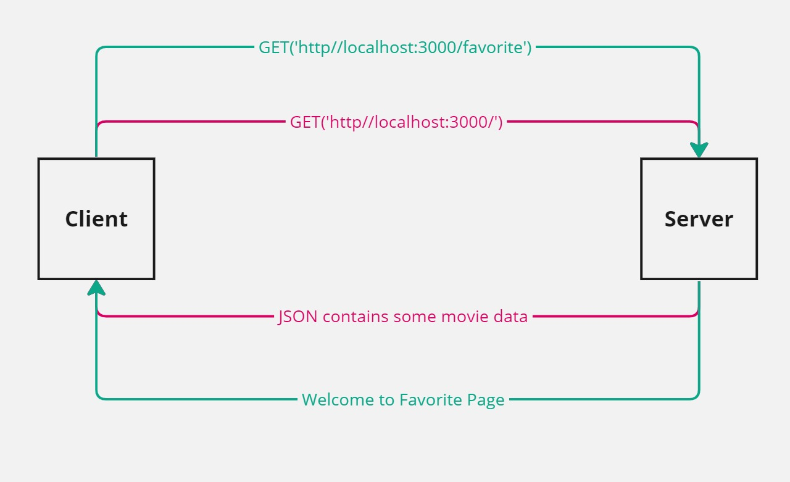

# Movies Library - v 1.0.0

**Author Name**: Loai Hasan


## WRRC




## Overview

This server is bluilt to provide the clients with the movies data like:
* Title.
* Original language.
* Vote average.
* Vote count.
* Release date.
* Popularity.
* etc.


## Getting Started

To get this project up and running on your local machine, follow these steps:

1. Clone the repository to your local machine:
   ```bash
   git clone https://github.com/Loiy2002-SW/Movies-Library.git

   ```

2. Navigate to the project:
```bash
cd your-project
```

3. Install dependencies:
```bash
npm install
```
4. Start the server:
```bash
node server.js
```
5. Open your web browser and visit http://localhost:3000 to view the application.


## Project Features

- **API Endpoints**:

    - **Home ('/')**: returns the moive with the title, poster_path and overview formatted in a json file.

    - **Favorite ('/favorite')**.

- **Error Handling**: The project includes robust error handling for both client and server errors.
    - **404 Error Handling**: When a page is not found (status code 404), the server responds with a friendly "Page not found" message.
    - **500 Error Handling**: In case of a server error (status code 500), the server responds with an appropriate error message, indicating that something went wrong.


